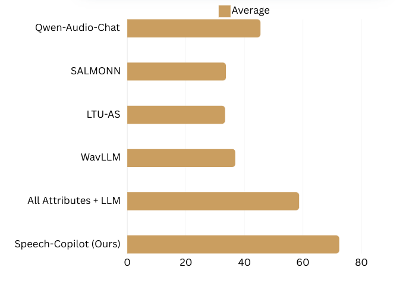

# Speech-Copilot: Leveraging Large Language Models for Speech Processing via Task Decomposition, Modularization, and Program Generation

  <a href="https://2024.ieeeslt.org/">[SLT2024]</a> 
  <a href="https://arxiv.org/abs/2407.09886">[arXiv]</a> 
  <a href="https://sites.google.com/view/slt2024-demo-page">[Demo]</a>

  

    
  

### The official Github page of the paper "Speech-Copilot: Leveraging Large Language Models for Speech Processing via Task Decomposition, Modularization, and Program Generation". 
- Authors: Chun-Yi Kuan🐤, Chih-Kai Yang🐤, Wei-Ping Huang🐦 , Ke-Han Lu🐦 , Hung-yi Lee
- 🐤 🐦: Equal Contribution 
- Affiliation: National Taiwan University
- Accepted to SLT2024
- arXiv Link: https://arxiv.org/abs/2407.09886
- Refer to our demo [website](https://sites.google.com/view/slt2024-demo-page) for more examples. 👍

## Overview ⭐

## Abstract 🔥
In this work, we introduce Speech-Copilot, a modular framework for instruction-oriented speech-processing tasks that minimizes human effort in toolset construction. 
Unlike end-to-end methods using large audio-language models, Speech-Copilot builds speech processing-specific toolsets by analyzing pre-collected task instructions and breaking tasks into manageable sub-tasks. 
It features a flexible agent based on large language models that performs tasks through program generation. 
Our approach achieves state-of-the-art performance on the Dynamic-SUPERB benchmark, demonstrating its effectiveness across diverse speech-processing tasks. 
Key contributions include: 1) developing an innovative framework for speech processing-specific toolset construction, 2) establishing a high-performing agent based on large language models, and 3) offering a new perspective on addressing challenging instruction-oriented speech-processing tasks. 
Without additional training processes required by end-to-end approaches, our method provides a flexible and extendable solution for a wide range of speech-processing applications.

## Evaluation Results 🏆

  
  

## Tooleset Construction 🔧
### Step1: User Instruction
- (1) Collect a pool of user instructions.
### Step2: Tasks Decomposition
- (1) Break down all the user instructions in the given pool and identify the speech modules required for each instruction.
- (2) Refer to `task_decomposition.py` for details.
### Step3: Tasks Modularization
- (1) After identifying the necessary speech modules, users can choose their preferred speech modules to serve as the backbone for these tasks.
- (2) Examples are provided in `prompt_templates/speech_module_generated_by_LLM.py`.
### Step4: Program Generation
- (1) Use an LLM to analyze the given user instruction and generate a solution program based on the speech modules created in the previous steps.
- (2) Refer to `program_generation.py` for guidance.
- (3) In `program_generation.py`, we provide an example task from [Dynamic-SUPERB](https://github.com/dynamic-superb/dynamic-superb) called [EmotionRecognition_MultimodalEmotionlinesDataset](https://huggingface.co/datasets/DynamicSuperb/EmotionRecognition_MultimodalEmotionlinesDataset) with the instruction: `Recognize and organize the emotional expressions in the spoken words. The answer could be anger, disgust, sadness, joy, neutral, surprise, or fear.`
### Step5: Program Execution
- (1) Execute the program generated in Step 4. Ensure the required speech modules from Step 3 are properly set up beforehand, so they can be utilized during execution.

## Baseline Models 🌲
- Qwen-Audio-Chat
    - Qwen-audio: Advancing universal audio understanding via unified large-scale audio-language models [[arXiv](https://arxiv.org/abs/2311.07919)]

- SALMONN
    - SALMONN: Towards Generic Hearing Abilities for Large Language Models [[arXiv](https://arxiv.org/abs/2310.13289)]

- LTU-AS
    - Joint Audio and Speech Understanding [[arXiv](https://arxiv.org/abs/2309.14405)]

- WavLLM
    - WavLLM: Towards Robust and Adaptive Speech Large Language Model [[arXiv](https://arxiv.org/abs/2404.00656)]

- Cascade (ASR + Audio Captioning Model + LLM)
    - ASR: Robust Speech Recognition via Large-Scale Weak Supervision [[arXiv](https://arxiv.org/abs/2212.04356)]
    - Audio Captioning Model: Qwen-audio: Advancing universal audio understanding via unified large-scale audio-language models [[arXiv](https://arxiv.org/abs/2311.07919)]
    - LLM: gpt-3.5-turbo